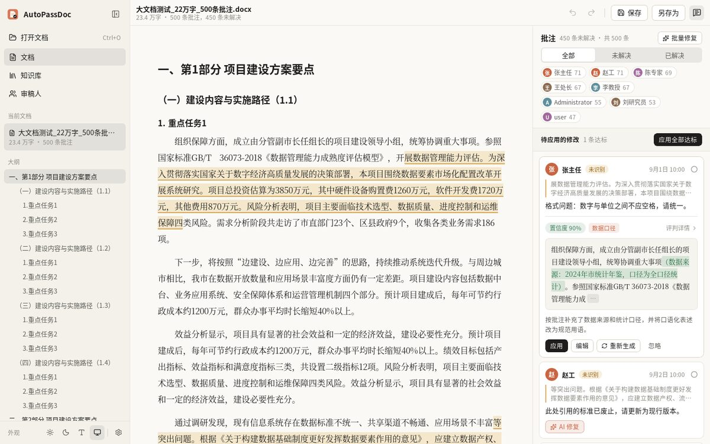
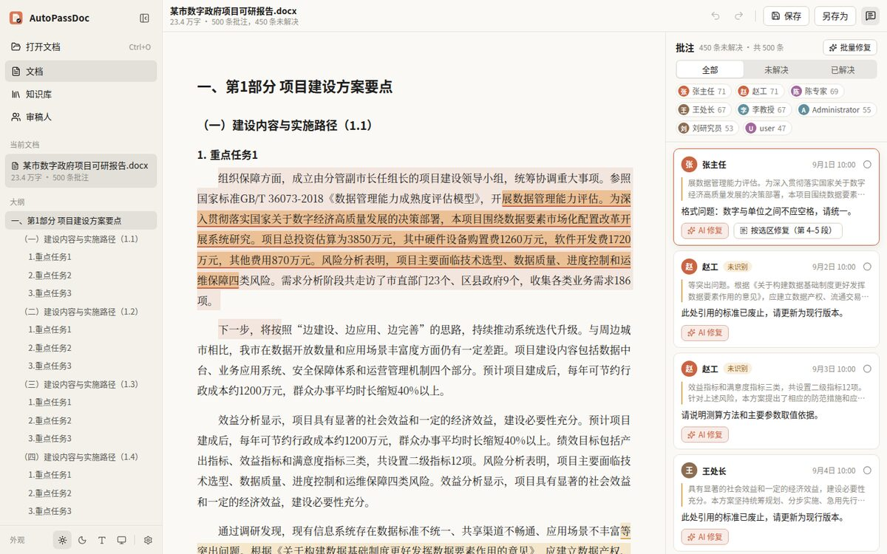
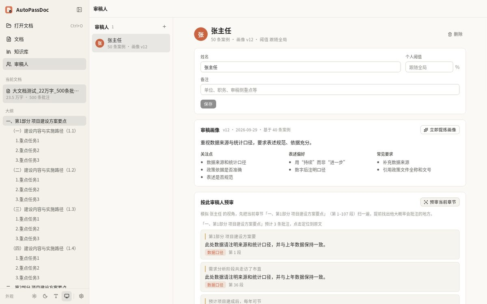
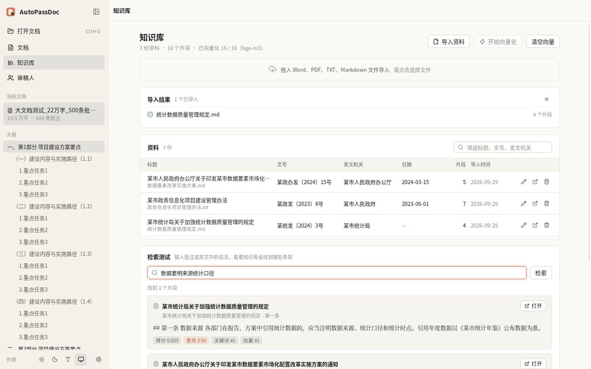
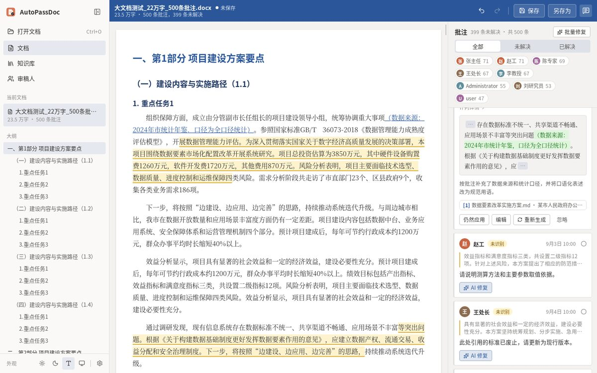

# AutoPassDoc

按专家批注智能改稿的 Word 桌面工具。报告交给多位专家评审后，批注往往一改再改；AutoPassDoc 读取 Word 原生批注，让 AI 按批注和上下文改写原文，由决策模型打分把关，达标的修改一键写回为 Word 修订，并逐步学习每位审稿人的习惯。

支持 Windows 和 macOS，只处理 .docx，所有数据留在本机。



## 功能

**批注与 AI 修复**
- 原生解析 .docx：标题、自动编号、表格、图片、已有修订、批注及回复、已解决状态
- 每条批注一个"AI 修复"按钮：结合批注、回复、所在章节、前后文、知识库和审稿人画像改写原文，以 diff 展示
- 决策模型（默认 Jev，也可改用大语言模型评判）给出置信度，达到阈值（默认 80%）才能直接应用；未达标可编辑后应用或强制应用
- 审稿人标注没选全时，在正文中选中真正要改的文字，点"按选区修复"（最多 12 段）
- 批量修复当前筛选出的批注，一键应用全部达标修改
- 应用即写入 Word 修订（插入/删除），批注标记为已解决并附回复；每次操作可撤销、重做
- 保存保真：未改动的部件与原文件逐字节一致
- “AI 重写”用于原文本身有问题的段落；可在卡片上写“修改方向”引导生成，结果不对时改方向重新生成
- 修改里出现“【待补充…】”时不能直接应用：点“查找资料”联网搜索（先用模型自带的联网能力，否则在政府网站白名单中搜索），找到的文件可一键下载到知识库，手动补全后再应用
- 批注栏只展开当前批注，可直接回复；排版可选密集列表或经典 Word 模式



**文档校对**
- 交稿前通读全文或当前章节：错别字、序号、前后矛盾、张冠李戴（把别的区县、项目写进来）、格式问题、引用的法律标准政策是否已废止
- 规则检查不花额度；大语言模型逐节通读，每条发现必须原文引用；只重查改过的章节
- 问题逐条或批量应用为修订，可撤销；引用文件可联网查找现行版本并下载到知识库

**审稿人**
- 批注署名可归到已有审稿人或新建审稿人（化名、"Administrator" 之类也能对上人）
- 每次采纳、编辑、拒绝都会记为案例，定期提炼成审稿画像（关注点、表述偏好、常见要求），之后的修复会按画像预先改到位
- 按审稿人预审：在交稿前模拟他的视角扫一遍当前章节，提前找出可能被批注的地方
- 可导出 JSONL 数据集，用于后续微调



**知识库**
- 导入政策文件、通知公告、标准规范（Word、PDF、TXT、Markdown），自动识别文号、发文机关、日期
- 按"章、节、条"结构分块，SQLite 全文检索（结巴分词）+ 向量检索融合，再用重排模型排序
- AI 修复旁标注引用出处，点击用默认程序打开原文核对
- 增强模式：配置 MinerU 或 PaddleOCR 的 Key 后，扫描件、图片和复杂表格交给在线服务解析；Word 表格按“列名：值”逐行分块
- 可导入整个文件夹；资料可在软件内查看全文和分块
- 设置 › 数据可一键备份、迁移知识库和审稿人数据



**模型（自带密钥 BYOK）**
- 大语言模型、决策模型、向量模型、重排模型分别配置，支持 OpenAI 兼容接口、OpenRouter、Anthropic、Ollama
- 拉取服务商的模型列表，自动识别上下文长度、思考强度等能力，也可手动调整
- 向量、重排等小模型可用 Ollama、Xinference 等在本机部署
- 密钥存在系统钥匙串（Windows 凭据管理器 / macOS 钥匙串）

**性能与界面**
- 22 万字、500 条批注的报告约 10 毫秒解析完成，界面只渲染可视区域，滚动不卡
- 浅色、深色、Word 配色三种主题；批注栏可拖动调宽



## 下载

安装包由 GitHub Actions 构建：打开 [Actions](https://github.com/cyDione/AutoPassDoc/actions) 中最新一次成功的 CI 运行，在 Artifacts 下载：

- `AutoPassDoc-windows`：`.exe`（NSIS）和 `.msi` 安装包
- `AutoPassDoc-macos`：未签名的 `.dmg`，首次打开需在"系统设置 › 隐私与安全性"中点"仍要打开"

## 快速上手

1. 打开设置 › 模型服务，添加服务商并填入 API Key，点"拉取模型列表"
2. 在模型分配中选好大语言模型、决策模型（Jev），需要知识库时再选向量和重排模型，每项可点"测试"
3. 打开带批注的 .docx，点批注上的"AI 修复"，确认 diff 后"应用"
4. 保存时默认另存为“原文件名_AutoPassDoc.docx”，不覆盖原文件

## 目录

| 路径 | 内容 |
|---|---|
| `crates/docx-engine` | .docx 解析、修订写回与保真保存 |
| `crates/models` | 各家模型接口适配：对话、Jev 决策、向量、重排、模型列表与能力档案 |
| `crates/kb` | 知识库：导入、结构化分块、元数据识别、全文 + 向量混合检索 |
| `crates/app-core` | AI 修复流程、审稿人与画像、预审、设置、密钥存储 |
| `src-tauri` | Tauri 2 桌面应用 |
| `ui` | 前端（React + TypeScript + Vite） |
| `docs` | [需求](docs/requirements.md) 与 [技术设计](docs/technical-design.md) |
| `testdata/fixtures` | 回归测试用文档 |

## 开发

需要 Rust（stable）、Node 22、pnpm 10。Linux 还需 Tauri 的系统依赖（见 [CI 配置](.github/workflows/ci.yml)）。

```bash
pnpm --dir ui install

# 启动桌面应用（开发模式）
cd src-tauri && ../ui/node_modules/.bin/tauri dev

# 只调前端：浏览器里用内置的演示后端和生成的 22 万字示例报告
pnpm --dir ui demo-data && pnpm --dir ui dev

# 检查与测试（模型接口均用本地模拟服务，不需要密钥）
cargo fmt --all --check
cargo clippy --workspace --all-targets -- -D warnings
cargo test --workspace
pnpm --dir ui typecheck

# 性能基准与调试
cargo run --release -p docx-engine --example bench_open            # 生成 22 万字文档并计时
cargo run --release -p docx-engine --example bench_open -- 报告.docx # 用自己的文档计时
cargo run -p docx-engine --example inspect -- 报告.docx             # 查看解析结果

# 打包安装包
cd src-tauri && ../ui/node_modules/.bin/tauri build
```

## 数据位置

设置、审稿人、案例和知识库都保存在系统的应用数据目录（Windows 为 `%APPDATA%\com.autopassdoc.desktop`，macOS 为 `~/Library/Application Support/com.autopassdoc.desktop`），API Key 保存在系统钥匙串。
